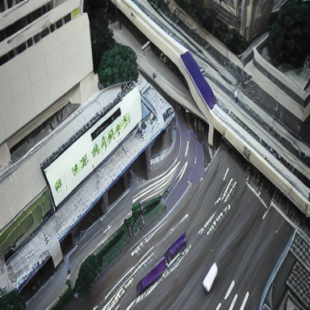
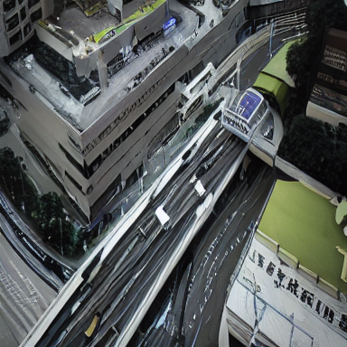
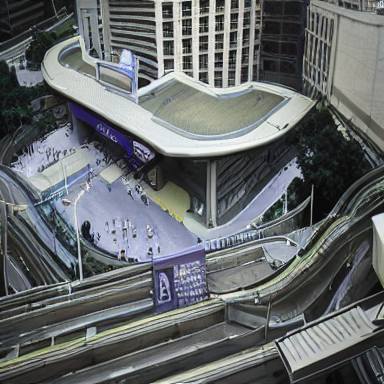
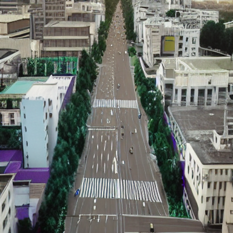
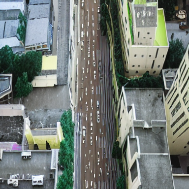
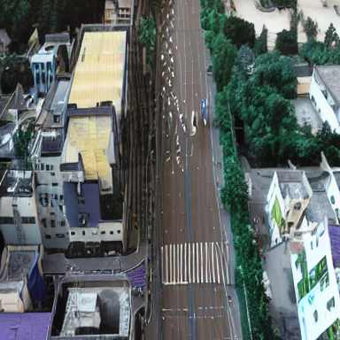
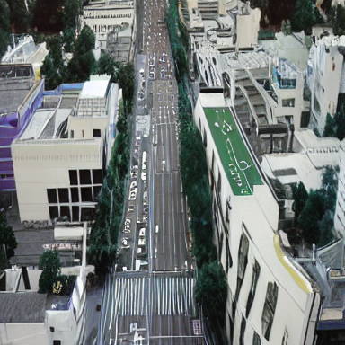
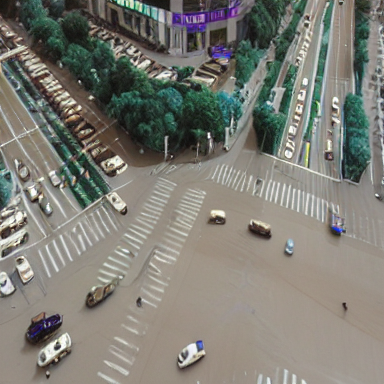
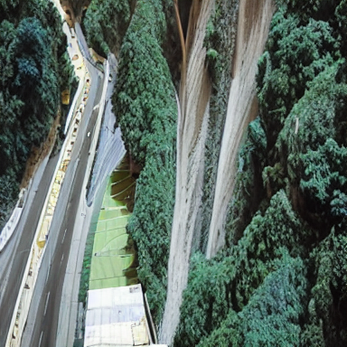

# aerial-story-diffusion

**Aerial image story synthesis using Auto-Regressive Latent Diffusion Models (ARLDM), trained on the VisDrone dataset.**

This project adapts the [ARLDM](https://github.com/xichenpan/ARLDM) architecture for aerial drone imagery, replacing the original story datasets (PororoSV, FlintstonesSV, VIST) with the VisDrone 2019 detection dataset. Training is fully cloud-orchestrated on NVIDIA A100 GPUs via [Modal](https://modal.com).

---

## Sample Results

Generated sequences at 384×384 resolution (150 DDIM steps, guidance scale 7.5):

| Urban Transit Hub (Story Sequence) | |
|---|---|
| Frame 1 | Frame 2 |
|  |  |
| Frame 3 | Frame 4 |
|  |  |

| City Boulevard (Story Sequence) | |
|---|---|
| Frame 1 | Frame 2 |
|  |  |
| Frame 3 | Frame 4 |
|  |  |

| Standout Samples | |
|---|---|
| City Intersection | Mountain Highway |
|  |  |

---

## Architecture

This project uses ARLDM — an Auto-Regressive Latent Diffusion Model for story visualization:

- **CLIP** (ViT-L/14) — encodes text captions for conditioning
- **BLIP** (multimodal encoder) — encodes prior frames for auto-regressive context
- **Stable Diffusion v1.5** (VAE + UNet) — generates images via DDIM denoising
- **Cross-Attention** — fuses text and visual context to guide each new frame

Each frame in a sequence is conditioned on all previous frames, ensuring temporal and spatial coherence across the story.

---

## Setup

```bash
python3 -m venv venv
source venv/bin/activate
pip install -r requirements.txt
```

---

## Dataset Preparation

1. Download the [VisDrone2019-DET-train](https://github.com/VisDrone/VisDrone-Dataset) dataset.
2. Obtain the Gemini text descriptions from [AeroDiffusion](https://github.com/NolimitDougie/AeroDiffusion/tree/main/text_descriptions).
3. Build the HDF5 dataset file:

```bash
python data_script/visdrone_hdf5.py
```

This will produce `visdrone.h5` in the project root.

---

## Cloud Training (Modal)

Training is orchestrated on Modal A100 GPUs. First, upload your dataset to a Modal volume:

```bash
modal volume create arldm-checkpoints
modal volume put arldm-checkpoints visdrone.h5 visdrone.h5
```

Then run training:

```bash
# Start or resume training
modal run modal_train.py --mode train --epochs 40 --ckpt visdrone_run/last.ckpt

# Run inference (150 DDIM steps)
modal run modal_train.py --mode sample --ckpt visdrone_run/last.ckpt --steps 150
```

Generated samples are automatically downloaded to `./samples/` after inference.

---

## Local Inference (MPS / CPU)

```bash
python main.py mode=sample \
  dataset=visdrone \
  test_model_file=ckpts/visdrone_run/last.ckpt \
  accelerator=mps
```

---

## Training Details

| Parameter | Value |
|-----------|-------|
| GPU | NVIDIA A100 (40GB) |
| Total Epochs | 40 |
| Resolution | 384×384 |
| Batch Size | 1 (accumulate × 4 = effective 4) |
| Learning Rate | 1e-5 |
| Scheduler | DDIM |
| Inference Steps | 150 |
| Guidance Scale | 7.5 |
| Final Train Loss | 0.080 |
| Final Val Loss | 0.162 |

**Training strategy:**
- Epochs 0–35: CLIP and BLIP encoders frozen, UNet training only
- Epochs 35–40: ResNet unfrozen for structural/geometric refinement

---

## Key Files

| File | Purpose |
|------|---------|
| `main.py` | Core ARLDM model and PyTorch Lightning training loop |
| `modal_train.py` | Cloud orchestration pipeline (train, sample, prepare modes) |
| `config.yaml` | All training and inference hyperparameters |
| `datasets/visdrone.py` | Custom HDF5 dataset class for VisDrone |
| `data_script/visdrone_hdf5.py` | Preprocessing script to build the HDF5 file |

---

## Acknowledgements

- Original ARLDM implementation by [Xichen Pan et al.](https://github.com/xichenpan/ARLDM)
- Text descriptions sourced from [AeroDiffusion](https://github.com/NolimitDougie/AeroDiffusion)
- VisDrone dataset from the [VisDrone team](https://github.com/VisDrone/VisDrone-Dataset)

## Citation

```bibtex
@article{pan2022synthesizing,
  title={Synthesizing Coherent Story with Auto-Regressive Latent Diffusion Models},
  author={Pan, Xichen and Qin, Pengda and Li, Yuhong and Xue, Hui and Chen, Wenhu},
  journal={arXiv preprint arXiv:2211.10950},
  year={2022}
}
```
